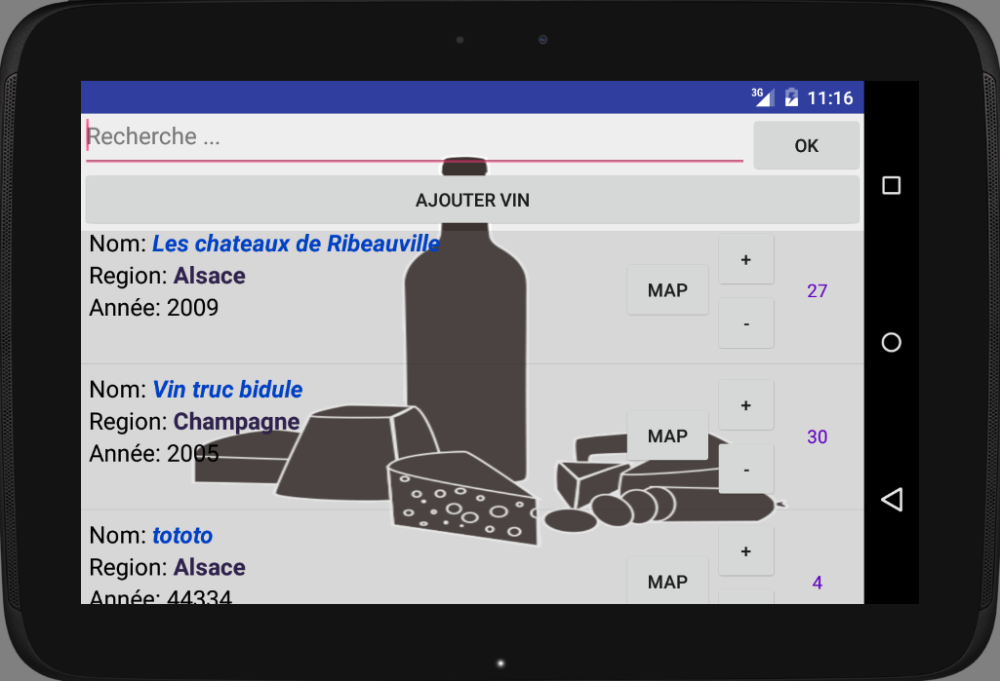

# Application cave à vin #

**BERNARD Tanguy**

**DUQUESNE Nicolas**

**RAMAGE Romain**

**ROPTIN Christophe**

### Objectif ###

L’objectif de ce Projet est de créer une application de cave à vin.

### Testé sur ###

* Nexus 10 API 21
* support de Google API's
* X86

### Installation ###

1. Récuperer le projet
2. Executer avec la configuration testé ou autre

### Resultat ###

  

